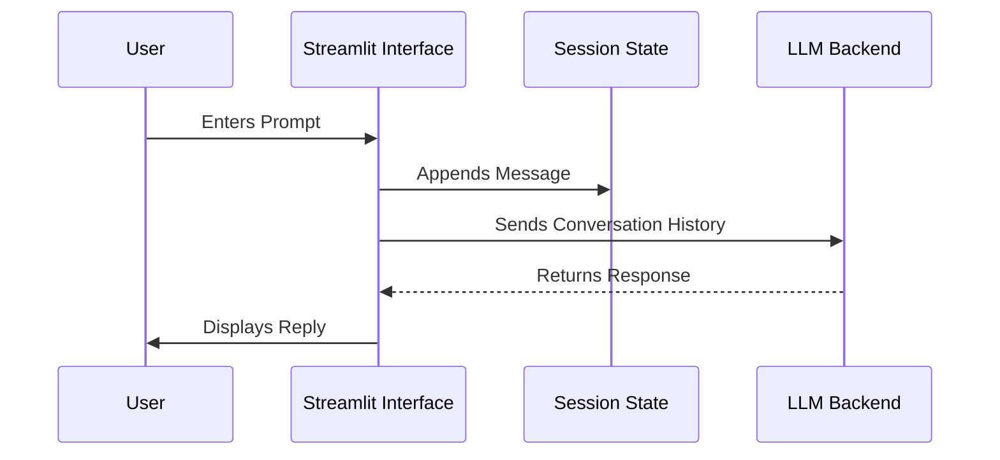

# 💬 Chatbot Pro

An advanced AI conversational interface built purely in Python using Streamlit for rapid deployment and ease of use.

## 🚀 Live Demo
[https://chatbot-dhgzk2we2tvhesudgcaffh.streamlit.app/](https://chatbot-dhgzk2we2tvhesudgcaffh.streamlit.app/)

## 🏗 Architecture & Data Flow
The architecture is streamlined for ML operations. Streamlit acts as both the frontend server and backend execution engine.
- **Execution**: The entire UI state is managed on every rerun, communicating directly with the LLM API.
- **State Management**: Uses `st.session_state` for maintaining chat history across re-renders.

## 🛠 Tech Stack
- **Framework**: Streamlit
- **Package Manager**: `uv` (Fast Python package manager via pyproject.toml)
- **Language**: Python 3.11+

## ⚙️ Quickstart
1. Clone the repo.
2. `pip install -r requirements.txt`
3. `streamlit run app.py`
